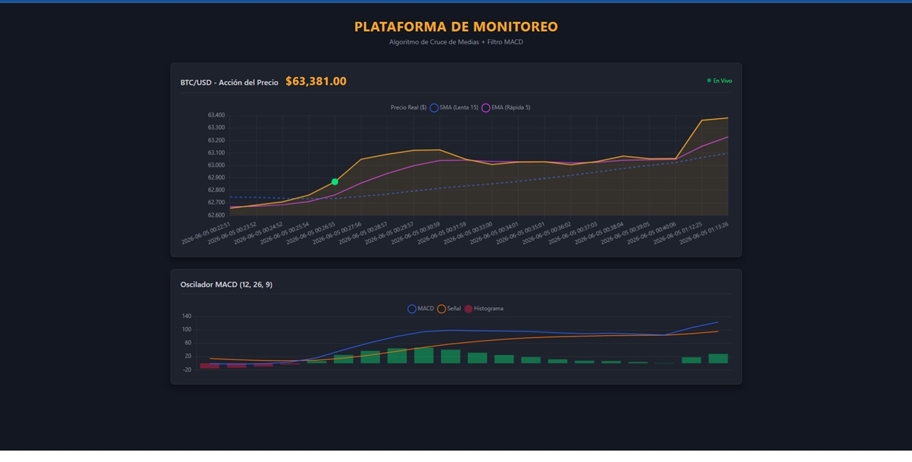

# 📈 Plataforma de Monitoreo Analítico y Trading Automatizado

Una aplicación web full-stack diseñada para la extracción de precios de criptomonedas en tiempo real, almacenamiento persistente y análisis técnico automatizado. El sistema utiliza algoritmos de doble confirmación para detectar señales del mercado sin intervención humana.

**Autor:** Jose Leon

## 🚀 Características Principales

* **Extracción Automatizada:** Un script en segundo plano consulta APIs financieras para obtener datos en tiempo real de BTC/USD.
* **Almacenamiento Persistente:** Base de datos relacional ligera integrada para guardar el historial de mercado.
* **Motor de Análisis Matemático:** Calcula indicadores técnicos en tiempo real:
  * Cruce de Medias Móviles (SMA 15 y EMA 5).
  * Oscilador MACD (12, 26, 9) para confirmación de impulso.
* **Interfaz de Usuario (Dark Mode):** Panel de control tipo "Terminal Financiera" que dibuja gráficos interactivos dinámicos sin recargar el DOM.
* **Sistema de Alertas:** Emite señales visuales en la interfaz y alertas sonoras nativas (Web Audio API) ante condiciones óptimas de Compra/Venta.

## 🛠️ Stack Tecnológico

* **Backend:** Python 3, Flask
* **Base de Datos:** SQLite3
* **Frontend:** HTML5, CSS3, Vanilla JavaScript
* **Visualización de Datos:** Chart.js

## ⚙️ Instalación y Uso

Si deseas correr este proyecto en tu entorno local, sigue estos pasos:

1. Clona este repositorio:
   
   git clone [https://github.com/Leo191202/Plataforma-de-Monitoreo-BTC-USD.git]

2.Instala las dependecias:
   
  pip install flask requests 

3.Ejecuta el motor de recolección de datos (abre una terminal):
   
  python extractor.py

4.Inicia el servidor web (abre una segunda terminal):
   
   python app.py

5.Navega a http://127.0.0.1:5000 en tu explorador.

## 📸 Capturas de Pantalla

